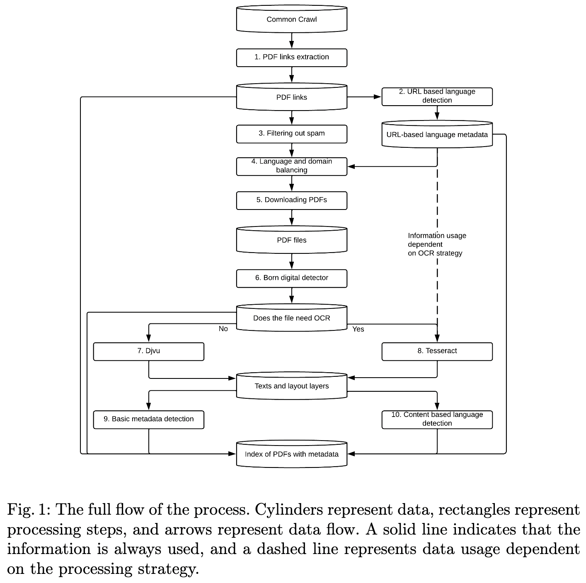

## Work In Progress (WIP)
This is a work in progress. Any contribution is appreciated

## Goal
This repo aims to provide the largest filterable PDF corpus. In addition to raw PDF files, we aim to provide text, language information and spam-filtering information for these files. Current efforts are focused on replicating CC-PDF[^1] pipeline

## TODO:
- [ ] Get prediction on file
    - [ ] OCR engines
        - [ ] Tesseract
        - [ ] Vision
        - [ ] Azure
        - [ ] Textract (might not do due to limited language support)
    - [ ] Language Detection
        - [ ] Langdetect
        - [ ] lingua-py
        - [ ] spacy
        - [ ] gcld
        - [ ] Language from OCR commercial OCR engines (Azure, Vision, etc)
    - [ ] Replicate `Born Digital detector` of CC-PDF for accurate PDF parsing
        - [ ] DjVu
        - [ ] pdfminer.six
        - [ ] pdfplumber
- [ ] Get statistics from crawl
    - [ ] Figure out safe way to download and parse PDF
    - [ ] Language detection from URL
    - [ ] Spam filtering stats from URL
- [ ] Parsing CC dumps
    - [ ] Figure out items here
- [ ] Replicate Section 4 (`Exploration of PDFs`) of CC-PDF
- [ ] Figure out appropriate license

### CC-PDF pipeline


## License
Aim is to provide this work and dataset in as permissible as possible license. Need to figure out the nitty gritty details b/w MIT, Apache-2, Creative Commons, etc licenses. 


[^1] CCpdf: Building a High Quality Corpus for Visually Rich Documents from Web Crawl Data
```bibtex
@misc{turski2023ccpdf,
      title={CCpdf: Building a High Quality Corpus for Visually Rich Documents from Web Crawl Data}, 
      author={Michał Turski and Tomasz Stanisławek and Karol Kaczmarek and Paweł Dyda and Filip Graliński},
      year={2023},
      eprint={2304.14953},
      archivePrefix={arXiv},
      primaryClass={cs.CL}
}
```